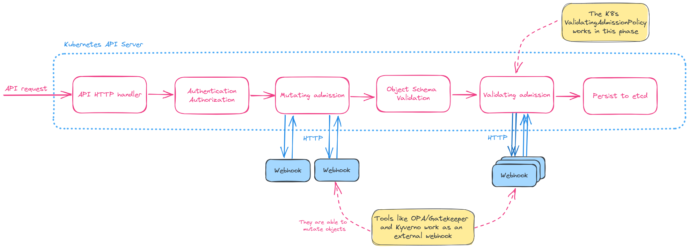

Discover why Validating Admission Policy should standardize the policy enforcement in Kubernetes ecosystem.
This article discusses benefits, motivation, and how to get started.
<!--more-->


This article was originally published on [Undistro's blog](https://undistro.io/blog/standardizing-enforcement-of-security-policies/).


## Introduction

Kubernetes 1.26 introduced the first alpha release of validating admission policies.

Validating admission policies offer a declarative, in-process alternative to [validating admission webhooks](https://kubernetes.io/docs/reference/access-authn-authz/extensible-admission-controllers/#what-are-admission-webhooks).
Validation rules for a policy are declared in [Common Expression Language (CEL)](https://github.com/google/cel-spec).

## Motivation

The current approach to enforcing custom policies within Kubernetes involves use of admission webhooks.
It is mainly done via external admission controllers in the ecosystem such as
[Kyverno](https://kyverno.io/) and [OPA/Gatekeeper](https://open-policy-agent.github.io/gatekeeper/website/).

Admission webhooks are HTTP callbacks that handle admission requests.
There are 2 types, either validating or mutating.
Mutating webhooks are able to modify objects before they are stored,
whereas validating webhooks can reject requests to enforce custom policies.

The diagram below shows phases of the admission control process.



While admission webhooks do offer great flexibility,
they come with a few drawbacks when compared to in-process policy enforcement:

- **Additional infrastructure**: required to host admission webhooks.
- **Latency**: requires another network hop.
- **Less reliable**: due to extra infrastructure dependencies.
- **"_Failing closed or failing open_" dilemma**: reduce the cluster availability or limit the efficacy of policy enforcement?
- **Operationally burdensome**: observability, security, and proper release/rollout/rollback plans.

## Getting started with Validating Admission Policies

Let's see how validating admission policies work.

Since this feature is in alpha stage, the [feature gate](https://kubernetes.io/docs/reference/command-line-tools-reference/feature-gates/)
`ValidatingAdmissionPolicy` should be enabled.

We can create a Kubernetes cluster with [Kind](https://kind.sigs.k8s.io/) providing a configuration file that
enables the feature gate.

```shell
kind create cluster --config kind-config.yaml
```

The content of `kind-config.yaml` file:

```yaml
kind: Cluster
apiVersion: kind.x-k8s.io/v1alpha4
featureGates:
  "ValidatingAdmissionPolicy": true
runtimeConfig:
  "admissionregistration.k8s.io/v1alpha1": "true"
nodes:
  - role: control-plane
    image: kindest/node:v1.27.2
```

The following command checks if the API is enabled:

```shell
kubectl api-resources | grep validating
validatingadmissionpolicies                      admissionregistration.k8s.io/v1alpha1   false        ValidatingAdmissionPolicy
validatingadmissionpolicybindings                admissionregistration.k8s.io/v1alpha1   false        ValidatingAdmissionPolicyBinding
validatingwebhookconfigurations                  admissionregistration.k8s.io/v1         false        ValidatingWebhookConfiguration
```

Once the `ValidatingAdmissionPolicy` is enabled, we are able to create our policies with CEL expressions.

Let's create a policy that enforces a tag different from `latest` in Pod images.

A policy is made up of at least two resources:
- The `ValidatingAdmissionPolicy` describes the logic of a policy.
- A `ValidatingAdmissionPolicyBinding` links the above resources together and provides scoping.

Here is our policy. The description of the most important fields are listed as comments, take a look.

```yaml
apiVersion: admissionregistration.k8s.io/v1alpha1
kind: ValidatingAdmissionPolicy
metadata:
  name: image-tag-latest
spec:
  failurePolicy: Fail # if an expression evaluates to false, the validation check is enforced according to this field
  matchConstraints:
    resourceRules:
      - apiGroups:   [""]
        apiVersions: ["v1"]
        operations:  ["CREATE", "UPDATE"]
        resources:   ["pods"]
  validations:
    # the field below contains a CEL expression to validate the request
    - expression: |
        object.spec.containers.all(container,
          container.image.contains(":") &&
          [container.image.substring(container.image.lastIndexOf(":")+1)].all(image,
            !image.contains("/") && !(image in ["latest", ""])
          )
        )
      message: "Image tag 'latest' is not allowed. Use a tag from a specific version."
---
apiVersion: admissionregistration.k8s.io/v1alpha1
kind: ValidatingAdmissionPolicyBinding
metadata:
  name: image-tag-latest
spec:
  policyName: image-tag-latest # references a `ValidatingAdmissionPolicy` name
  validationActions: [Deny] # `Deny` specifies that a validation failure results in a denied request
  matchResources: {} # an empty `matchResources` means that all resources matched by the policy are validated by this binding
```

Now we can apply the policy:
```shell
kubectl apply -f vap.yaml
```

If you try to create a Pod with an untagged image, an error will return with the message we defined:

```shell
kubectl apply -f pod.yaml
The pods "nginx" is invalid: : ValidatingAdmissionPolicy 'image-tag-latest' with binding 'image-tag-latest' denied request: Image tag 'latest' is not allowed. Use a tag from a specific version.
```

The content of `pod.yaml` file is below.

```yaml
apiVersion: v1
kind: Pod
metadata:
  name: nginx
  labels:
    app: nginx
spec:
  containers:
    - name: nginx
      image: nginx
      imagePullPolicy: IfNotPresent
  restartPolicy: Always
```

Different values can be substituted in the `image` field to test different cases:

| Image                                                                           | Expect |
|---------------------------------------------------------------------------------|--------|
| `nginx@sha256:af296b188c7b7df99ba960ca614439c99cb7cf252ed7bbc23e90cfda59092305` | pass   |
| `nginx:1.25.0`                                                                  | pass   |
| `nginx:latest`                                                                  | fail   |
| `nginx`                                                                         | fail   |


## Comparing policies

See how the same policy is defined in external admission controllers.

<!-- Tab -->
Validating Admission Policy:
<!-- Tab -->

```yaml
apiVersion: admissionregistration.k8s.io/v1alpha1
kind: ValidatingAdmissionPolicy
metadata:
  name: image-tag-latest
spec:
  failurePolicy: Fail # if an expression evaluates to false, the validation check is enforced according to this field
  matchConstraints:
    resourceRules:
      - apiGroups:   [""]
        apiVersions: ["v1"]
        operations:  ["CREATE", "UPDATE"]
        resources:   ["pods"]
  validations:
    # the field below contains a CEL expression to validate the request
    - expression: |
        object.spec.containers.all(container,
          container.image.contains(":") &&
          [container.image.substring(container.image.lastIndexOf(":")+1)].all(image,
            !image.contains("/") && !(image in ["latest", ""])
          )
        )
      message: "Image tag 'latest' is not allowed. Use a tag from a specific version."
```

<!-- Tab -->
OPA/Gatekeeper:
<!-- Tab -->

```yaml
apiVersion: templates.gatekeeper.sh/v1
kind: ConstraintTemplate
metadata:
  name: k8sdisallowedtags
spec:
  crd:
    spec:
      names:
        kind: K8sDisallowedTags
      validation:
        openAPIV3Schema:
          type: object
          properties:
            tags:
              type: array
              description: Disallowed container image tags.
              items:
                type: string
  targets:
    - target: admission.k8s.gatekeeper.sh
      rego: |
        package k8sdisallowedtags

        violation[{"msg": msg}] {
            container := input_containers[_]
            tags := [forbid | tag = input.parameters.tags[_] ; forbid = endswith(container.image, concat(":", ["", tag]))]
            any(tags)
            msg := sprintf("container <%v> uses a disallowed tag <%v>; disallowed tags are %v", [container.name, container.image, input.parameters.tags])
        }

        violation[{"msg": msg}] {
            container := input_containers[_]
            tag := [contains(container.image, ":")]
            not all(tag)
            msg := sprintf("container <%v> didn't specify an image tag <%v>", [container.name, container.image])
        }

        input_containers[c] {
            c := input.review.object.spec.containers[_]
        }
        input_containers[c] {
            c := input.review.object.spec.initContainers[_]
        }
        input_containers[c] {
            c := input.review.object.spec.ephemeralContainers[_]
        }
---
apiVersion: constraints.gatekeeper.sh/v1beta1
kind: K8sDisallowedTags
metadata:
  name: container-image-must-not-have-latest-tag
spec:
  match:
    kinds:
      - apiGroups: [""]
        kinds: ["Pod"]
    namespaces:
      - "default"
  parameters:
    tags: ["latest"]
```

<!-- Tab -->
Kyverno:
<!-- Tab -->

```yaml
apiVersion: kyverno.io/v1
kind: ClusterPolicy
metadata:
  name: disallow-latest-tag    
spec:
  validationFailureAction: audit
  background: true
  rules:
  - name: require-image-tag
    match:
      any:
      - resources:
          kinds:
          - Pod
    validate:
      message: "An image tag is required."
      pattern:
        spec:
          containers:
          - image: "*:*"
  - name: validate-image-tag
    match:
      any:
      - resources:
          kinds:
          - Pod
    validate:
      message: "Using a mutable image tag e.g. 'latest' is not allowed."
      pattern:
        spec:
          containers:
          - image: "!*:latest"
```

<!-- Tab -->
Kyverno with CEL (**new**):
<!-- Tab -->

> Kyverno recently has added support for CEL expressions. See the [PR](https://github.com/kyverno/kyverno/pull/7070).
> This is a very recent feature, and the API is subject to change. As of this post's writing, this feature has not yet been documented.

```yaml
apiVersion: kyverno.io/v1
kind: ClusterPolicy
metadata:
  name: disallow-latest-tag
spec:
  validationFailureAction: Enforce
  background: false
  rules:
    - name: image-tag
      match:
        any:
          - resources:
              kinds:
                - Pod
      validate:
        cel:
          expressions:
            - expression: |
                object.spec.containers.all(container,
                  ( container.image.contains(":") || container.image.contains("@") )
                  && !container.image.endsWith(":latest")
                )
              message: "Image tag 'latest' is not allowed. Use a tag from a specific version."
```

## Conclusion

Looking at the Kubernetes ecosystem as a whole, it is evident that there's a demand for opinionated policy frameworks.
The existence of security regimes such as [CIS Kubernetes Benchmarks](https://www.cisecurity.org/benchmark/kubernetes)
emphasizes the importance of standardized controls.

Validating Admission Policy is a policy enforcement feature that fulfills a community need and
should be the best alternative for the vast majority of validations due to
reduced infrastructure footprint and the simplicity of CEL.

In-process admission control has fundamental advantages over webhooks:
it is far safer to use in a "fail closed" mode because it removes the network as a possible failure domain.

According to the [KEP (Kubernetes Enhancement Proposal) of this feature](https://github.com/kubernetes/enhancements/blob/master/keps/sig-api-machinery/3488-cel-admission-control/README.md),
it's not a goal currently to support mutations and to build an in-tree policy framework.
Therefore, projects in the ecosystem should not be completely replaced when this feature is graduated.
Instead, they should make use of these APIs' extensibility and configurability.

One of the goals is to provide core functionality as a library and enable other tools to run the same CEL validation checks that the API server does.
This should popularize the use of CEL for policies and checks in the Kubernetes ecosystem.

Even though still in alpha stage, we can already observe the impact of Validating Admission Policy:
Kyverno is developing a feature which supports CEL expressions in validations,
as can be seen in the [comparing policies section](#comparing-policies).

We should expect to see new projects emerging that use CEL in use cases beyond admissions control.
One great example is [Marvin](https://github.com/undistro/marvin), a CLI tool that scans Kubernetes clusters by performing CEL expressions to report potential issues.
Marvin has 30+ built-in checks and also supports custom checks with CEL, allowing you to use virtually the same expression in both cases:
Kubernetes `ValidatingAdmissionPolicy` (policy enforcement) and Marvin (cluster scanner).

## References

- https://kubernetes.io/docs/reference/access-authn-authz/validating-admission-policy
- https://kubernetes.io/blog/2022/12/20/validating-admission-policies-alpha
- https://kubernetes.io/docs/reference/access-authn-authz/extensible-admission-controllers
- https://github.com/kubernetes/enhancements/blob/master/keps/sig-api-machinery/3488-cel-admission-control/README.md
- https://github.com/undistro/marvin
